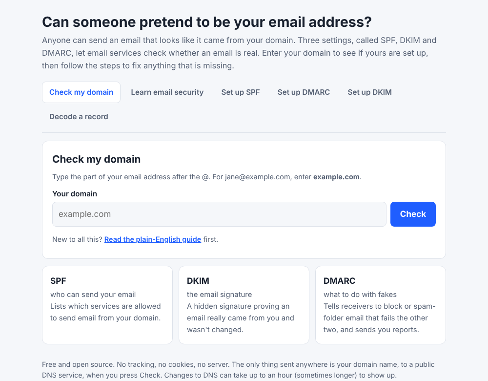
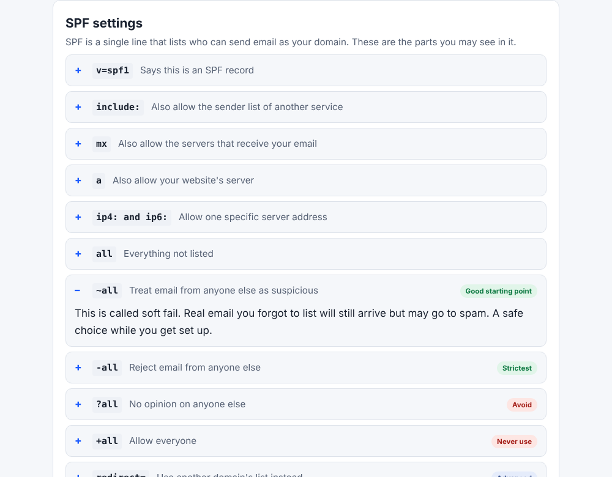
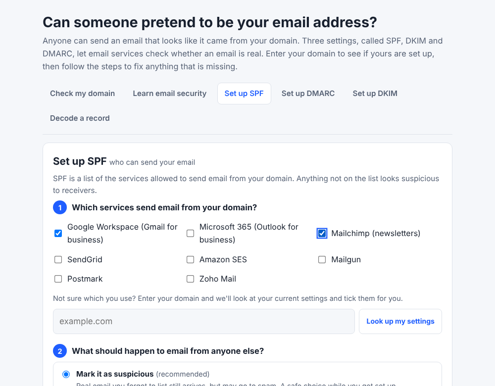

# Email Record Checker

Checks whether your domain has SPF, DKIM and DMARC set up, explains what it finds in plain English, and shows you how to fix anything that's missing. It runs in your browser.

**Live version:** https://email-record-checker.harryyelland.workers.dev/

## What it's for

Anyone can write any address in the "From" line of an email. So someone can send a message that looks like it came from your domain when it didn't. SPF, DKIM and DMARC are three settings you add to your domain that let email services check. Most checkers assume you already know what those are. This one doesn't.

## What's in it

**Check my domain.** Enter a domain and it looks up the SPF, DKIM and DMARC records. You get a summary (well protected, partly protected or easy to impersonate), a short list of what to do next, and a card for each record. The technical detail is tucked away under "Technical details".

**Set up SPF, DMARC and DKIM.** Each one has its own page with tick boxes and plain choices. They give you the Type, Name and Value to copy into your DNS, with copy buttons and instructions for adding a record at any registrar. The DKIM page also explains how to turn it on in Google Workspace and Microsoft 365, and has a key generator for people who run their own mail server.

**Decode a record.** Paste in any SPF, DKIM or DMARC record and it tells you what each part means and what's wrong with it.

**Learn email security.** A searchable guide with 67 short entries. It covers common DNS words, every SPF, DMARC and DKIM setting, what the result labels mean, and the mistakes people make most.

| Learn tab | SPF setup |
| --- | --- |
|  |  |

## How it works

It's one `index.html` file with plain JavaScript. There's no build step, no framework and nothing to install.

**DNS lookups.** It asks Cloudflare's DNS-over-HTTPS service for the records, and asks Google's if Cloudflare doesn't answer. It reads the TXT records at your domain (SPF), at `_dmarc.yourdomain` (DMARC) and at `selector._domainkey.yourdomain` (DKIM). It also reads your MX records to guess which mail provider you use.

**SPF.** It reads the record one part at a time and flags common problems, such as `+all`, a missing `all`, the old `ptr` setting, more than one record, and terms it doesn't recognise. It counts the DNS lookups the record needs, including the ones inside any `include`, and compares them with the limit of 10. It also matches include addresses to about 40 well-known services, so you see "Google Workspace" instead of `_spf.google.com`.

**DKIM.** DNS can't list a domain's DKIM keys, so it tries 17 common selector names, like `google`, `selector1` and `k1`. If it finds a key, it works out the key size and, where it can, which service the key belongs to. If it finds nothing, it says that doesn't mean DKIM is missing and shows you how to check from an email header.

**DMARC.** It reads each tag and checks the policy, the percentage, the report addresses, the subdomain policy and the matching modes.

**Generators.** The SPF and DMARC pages build the record from the options you choose. The DKIM page makes a key pair with the browser's Web Crypto API (RSA with SHA-256). It gives you the public record for DNS and the private key as a PEM file.

## Privacy and security

- There's no server, no cookies and no analytics, and nothing is stored.
- The only requests it makes are DNS lookups for the domain you check. They go to Cloudflare, or to Google if Cloudflare fails.
- DKIM keys are made in your browser. The private key never leaves it.
- A Content-Security-Policy tag limits the page to those two DNS services.
- Anything that comes from DNS records or from you is escaped before it's shown on the page.

## Running it yourself

Open `index.html` in a browser. To serve it locally, run `python3 -m http.server` in the folder and go to `http://localhost:8000`. The DKIM key generator needs a secure connection, so use localhost or HTTPS if it doesn't work from a file.

To put it online, upload the files to any static host, such as GitHub Pages, Cloudflare or Netlify. If your address is different, change the `canonical`, `og:url` and `og:image` tags near the top of `index.html` so link previews point at your copy.

## Changing things

Most of what you'd want to edit is in tables inside the script at the bottom of `index.html`:

- `SERVICES` links include addresses to service names. Add a line for each new service.
- `DKIM_SERVICES` and `SELECTORS` set which DKIM names it tries and how it labels them.
- `LEARN` holds all the text in the Learn tab.

## What it doesn't do

- It only tries common DKIM names. If yours isn't one of them, use the "I know my DKIM selector" option that appears when nothing is found.
- If you check a subdomain, it doesn't fall back to the main domain's DMARC record.
- It doesn't check whether report addresses on other domains have agreed to receive DMARC reports.
- It doesn't cover related standards like MTA-STS, TLS-RPT or BIMI.
- The results are guidance, not a full check of every rule in the standards.
- The service names and the Google and Microsoft instructions were written from general knowledge, so they can go out of date.

## Files

- `index.html` is the whole tool.
- `og-image.png` is the preview image shown when someone shares the link.
- `screenshots/` holds the images used in this README.
- `LICENSE` is the MIT licence.

## Author

Harry Yelland

## Licence

MIT. See [LICENSE](LICENSE).
